# Creating IAM User

- Go to Services and search for IAM

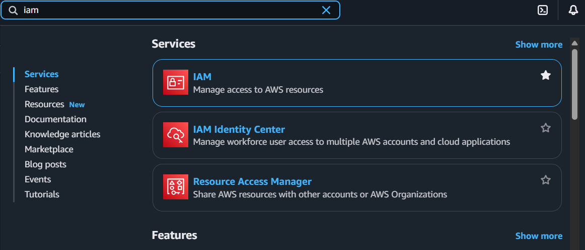  

---

- Click create user and edit your preferences for the new IAM user

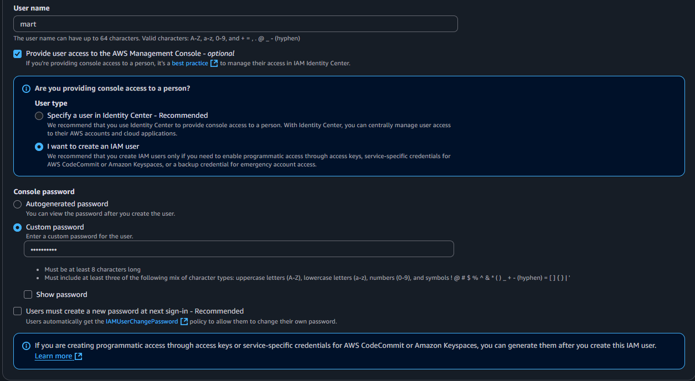  

---

- Successfully provisioned IAM user "mart" with console access.

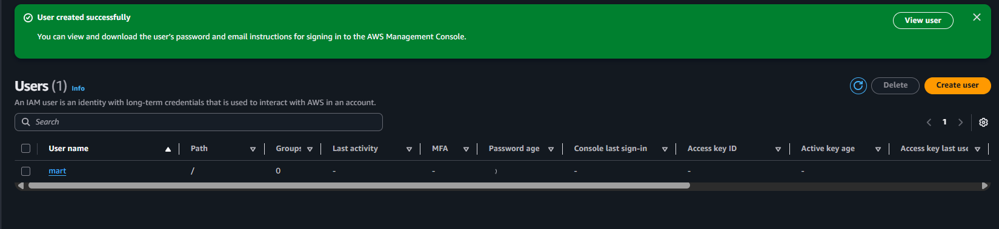  

---

## Add User to a group
- you can choose what to do the IAM user `add user to group , copy permission or attach policies directly.`

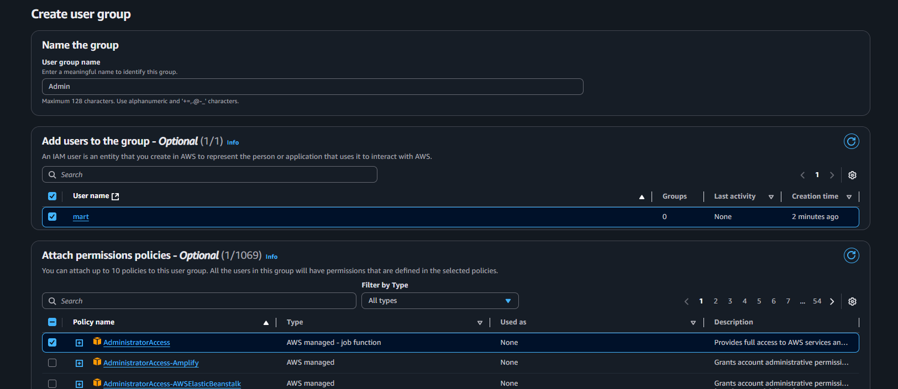  

---

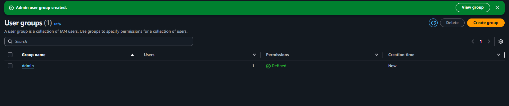  

---

- Check the User Group admin and see if user `mart` is there

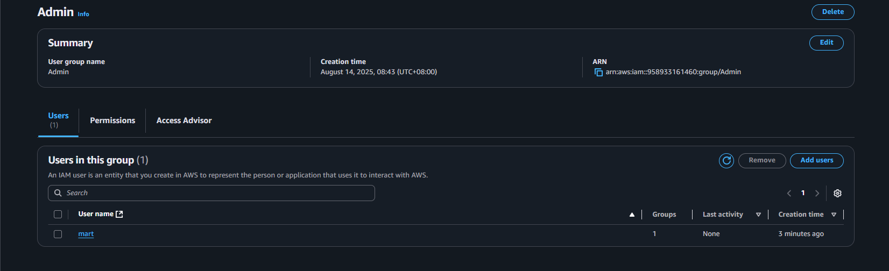  

---
- review your configuration and make sure to download the `.csv file` and email to the user

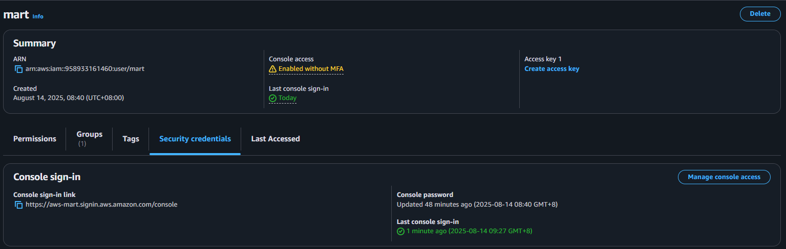  

---

## Access Key

- Create Access key for Programmically Use

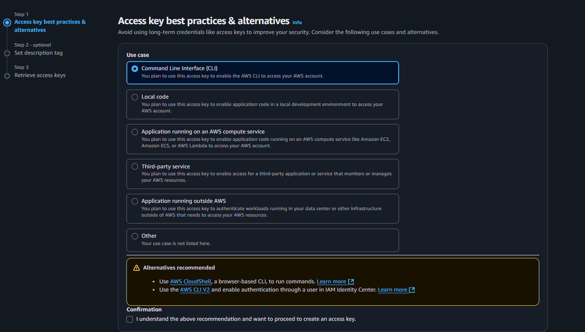  

---

- Retrieve and save both access keysif lost, they can't be recovered and must be replaced.

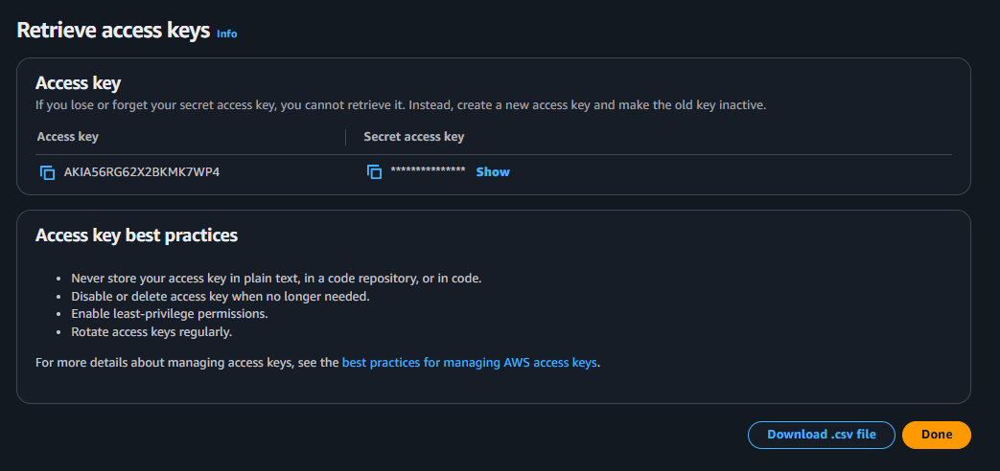  

---

## Verifying IAM User

- Verify that the `IAM user` can access AWS by testing credentials in your machine’s `CLI`.

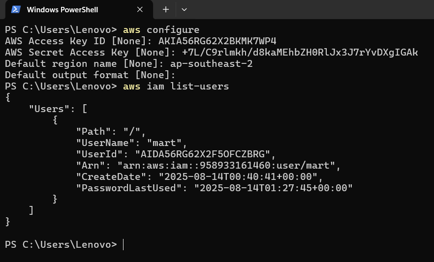  

---

## Delete IAM User

- Go to the IAM User Console GUI and Click delete
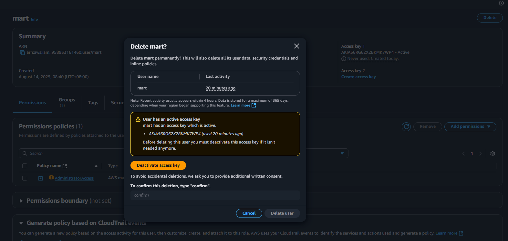  

--- 

- Check if the IAM Users if User `mart`  is deleted

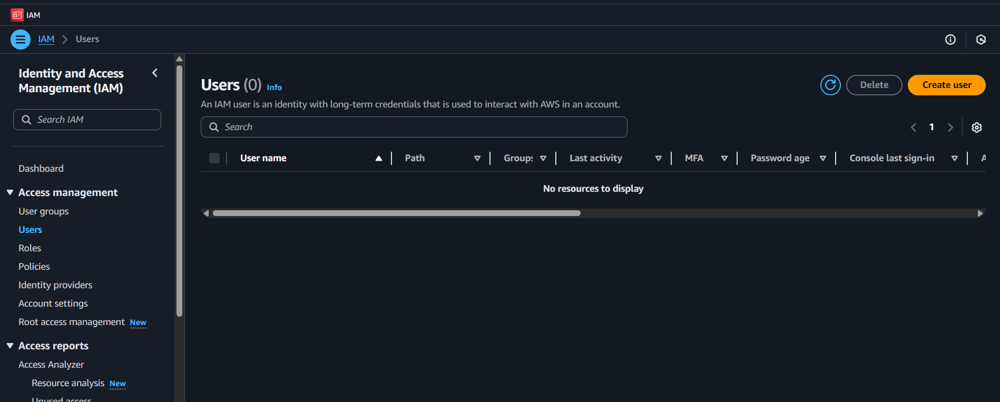  

