# Application Load Balancing (ALB)

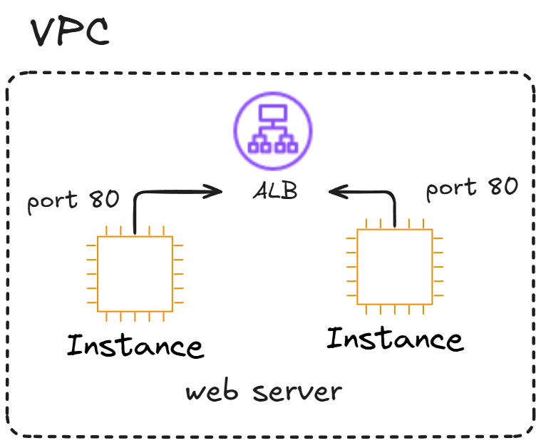  

---

## Creating 2 Instances

- Start by launching two EC2 instances these will serve as targets for the Application Load Balancer.

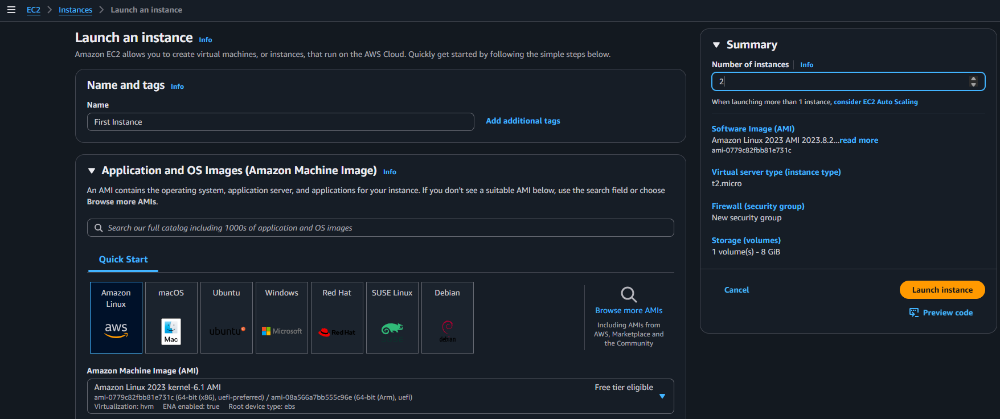  

---

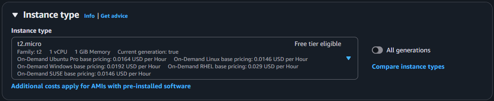  

---

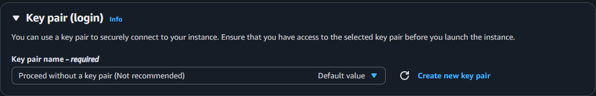  

---

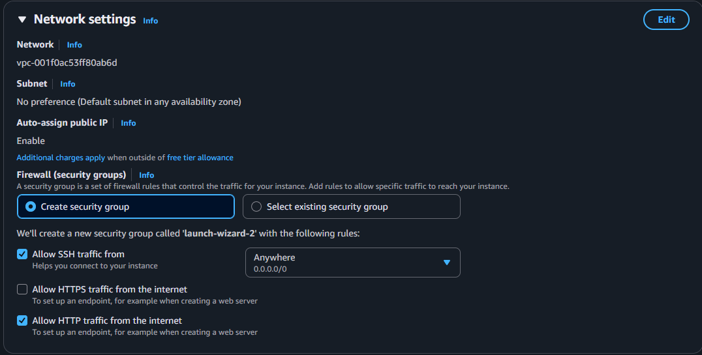  

---

- Added simple scripts to set up a web server and display the instance’s IP address using `echo` for quick verification and testing.

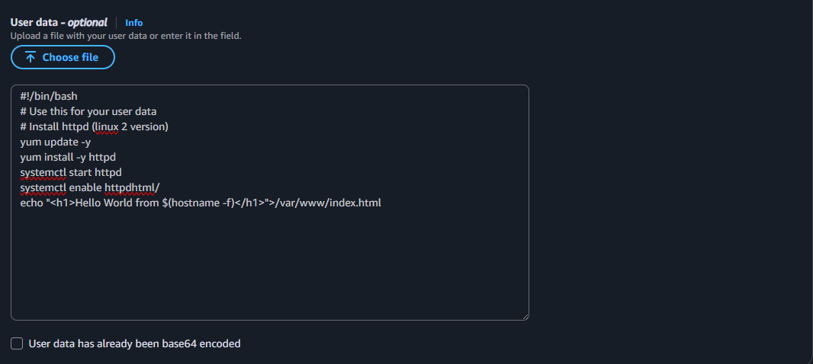  

---

- Verified both EC2 instances are running the web server and responding correctly confirming successful setup and connectivity.

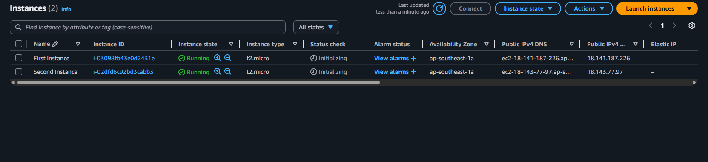  

---

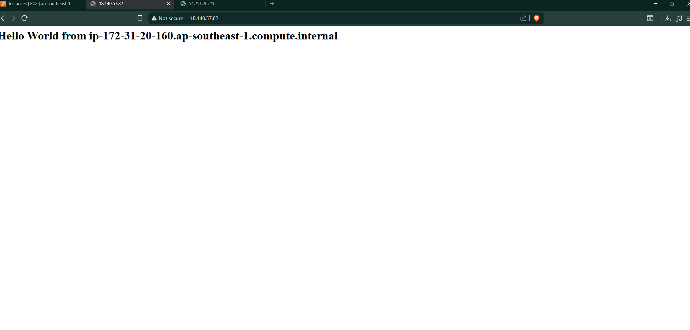  

---

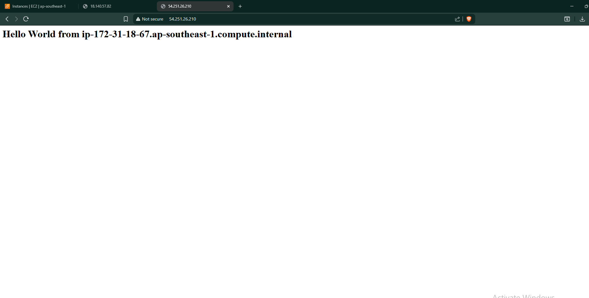  

---

## Creating Application Load Balancer

- Next, create an Application Load Balancer to distribute traffic evenly across the two EC2 instances.

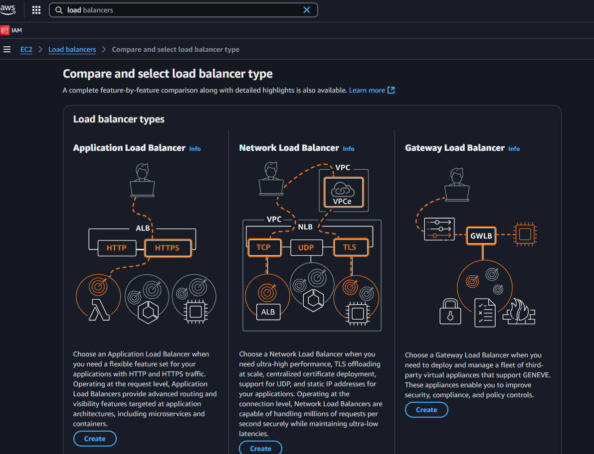  

---

- Configured public IPv4 IPAM pool and selected three subnets across availability zones `ap-southeast-1a, 1b, and 1c.` This ensures high availability and fault tolerance for the Application Load Balancer

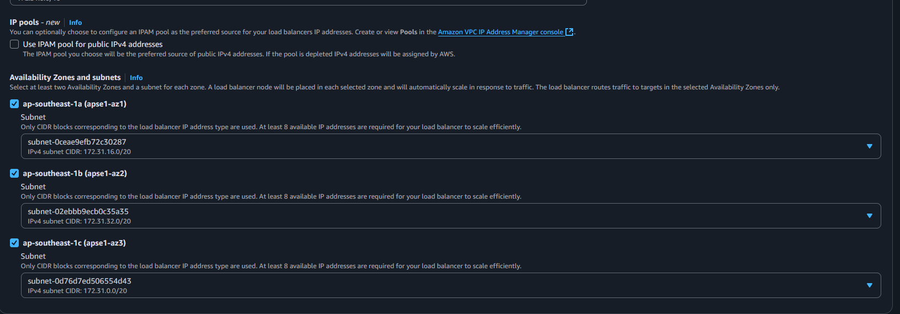  

---

- Allowed HTTP (port 80) for public access. Outbound traffic is fully open for updates and connectivity.

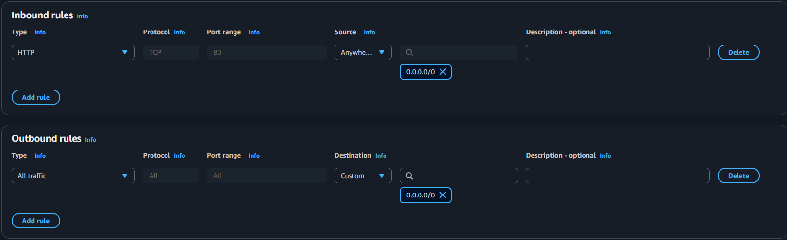  

---

- Created target group demo-tg-alb using HTTP on port 80 with IPv4 in VPC vpc-001f0ac53ff80ab6d. This config ensures traffic routing to EC2 instances via ALB with HTTP1 protocol.

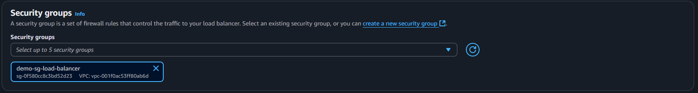  

---

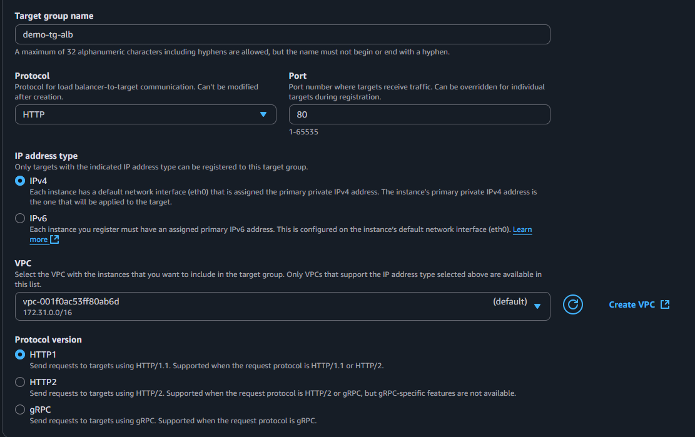  

---

- Added two EC2 instances to target group demo-tg-alb for HTTP traffic on port 80.

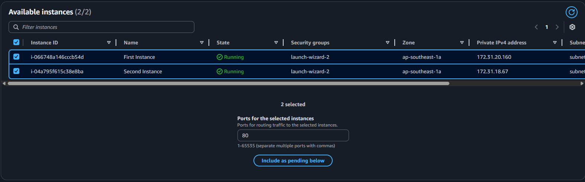  

---

- Created demoALB, an internet-facing Application Load Balancer across three subnets for high availability. Screenshot shows its transition from Provisioning to Active status, confirming successful setup.

  

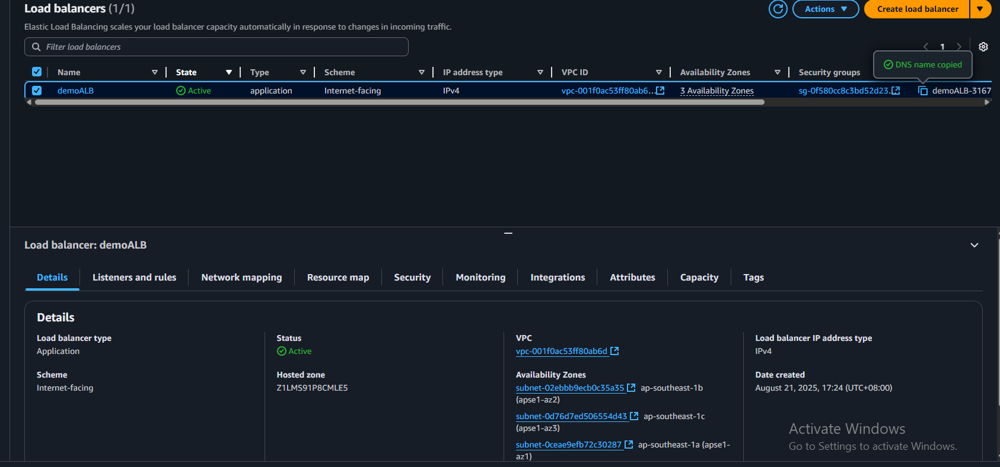  

---

## Checking if ALB is running correctly

- Accessed the ALB URL and confirmed traffic is routing to both EC2 instances. Each response shows a unique internal IP, proving round-robin distribution is working.

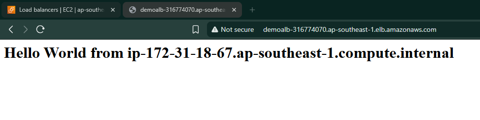  

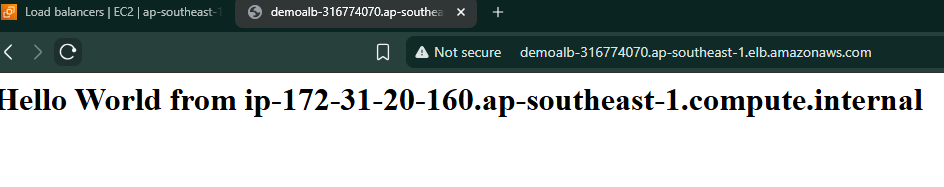  

---

- Two EC2 instances added to target group demo-tg-alb. One is running and marked Healthy, the other is Stopped and marked Unused. Load Balancer routes traffic only to active targets.

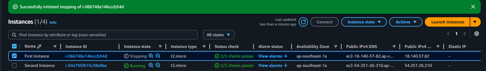  

---

- After stopping the first EC2 instance, the Load Balancer automatically detected its unhealthy status and routed traffic only to the remaining active instance. This confirms proper health check configuration and failover behavior.

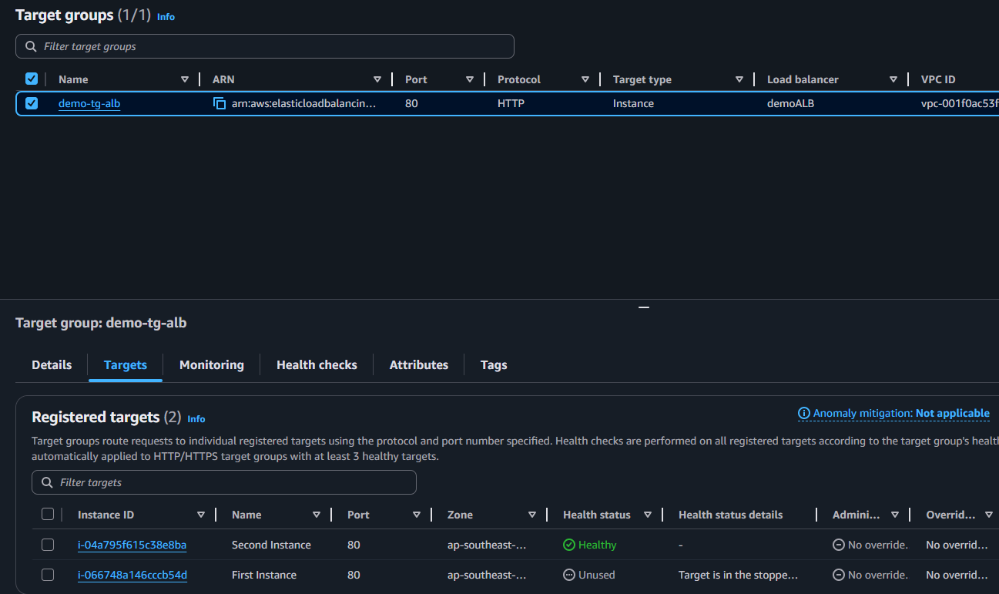  

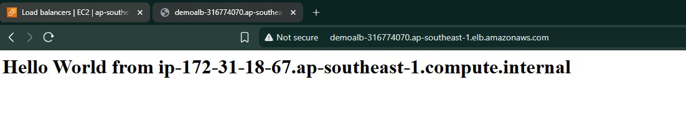  

