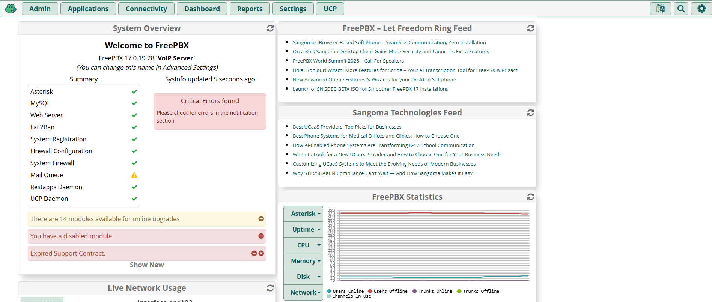
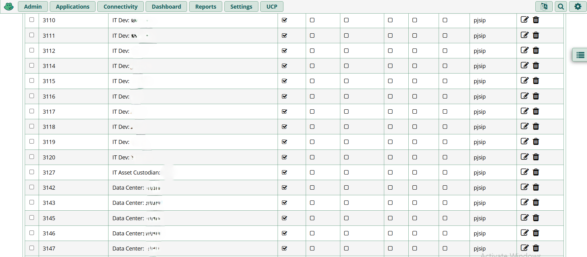
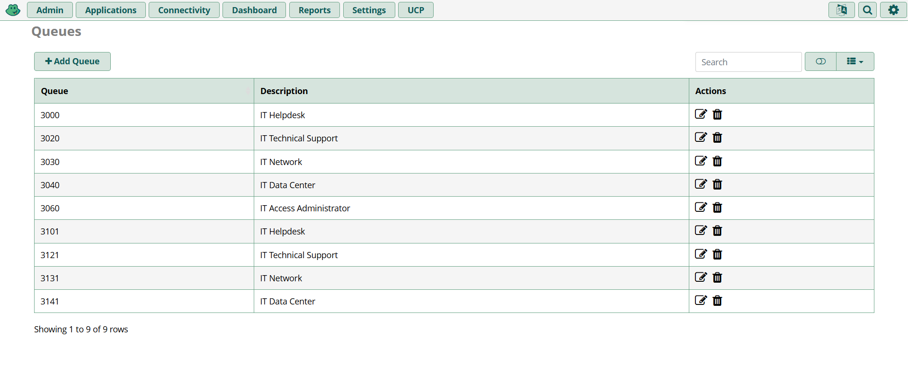
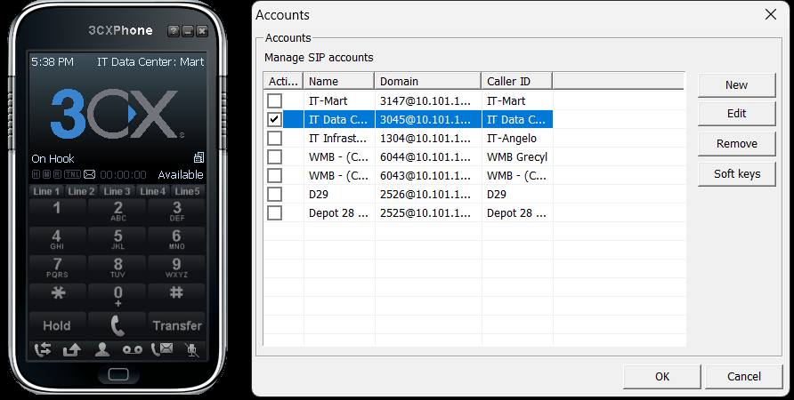

<h1 style="text-align: center;"> Free PBX </h1>

## 📞 What is FreePBX?

- Open-source web GUI for managing Asterisk (VoIP PBX system)
- Used to build and control business phone systems

## 🚀 Benefits

- Free to use and highly customizable

- Scales easily with unlimited extensions

- Compatible with SIP trunks and legacy hardware

---

## Free PBX Server

  

---

## Free PBX Dashboard

  

---

## Extensions

  

---

## Queues

  

## 3CX

  
