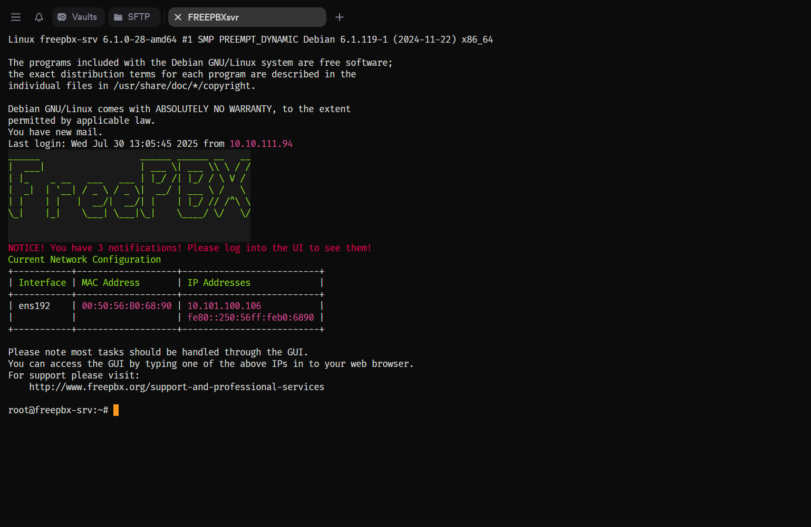

# Free PBX Server

  

---

## Free PBX Dashboard

  

---

## Extensions

- Internal numbers assigned to employees and managers for direct communication within the PBX.

  

---

## Queues

- Call groups that route incoming calls—starting with Helpdesk, which forwards them to the right team based on client needs.

  

## 3CX

- This is the 3CX softphone interface I use for managing SIP accounts. The active account is for our IT team, while the others are test accounts I configured to simulate multi-branch setups and validate call routing, presence, and provisioning workflows.

  
