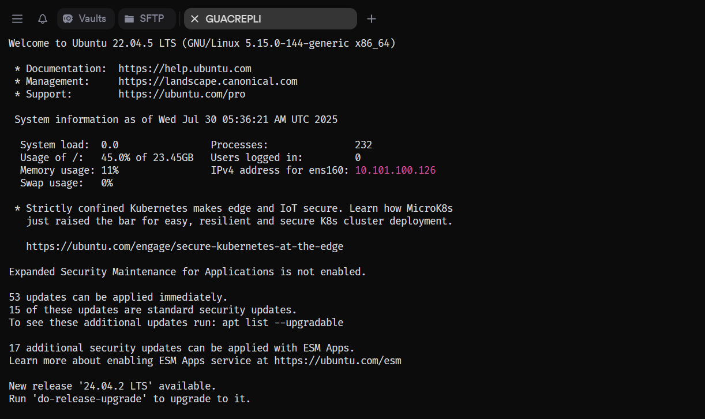
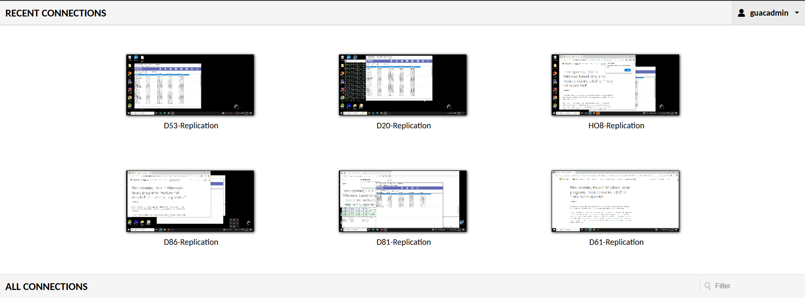
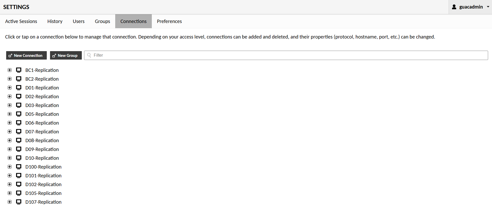

# Guacamole Server

  

---

## Guacamole Dashboard

- This is the Guacamole Dashboard I maintain for remote access across our replicated branch systems. Each tile—like D53-Replication or DB6-Replication—represents a live session, often tied to mirrored environments for redundancy.

- As guacadmin, I manage access, naming conventions, and grouping to keep things scalable and intuitive. I’ve also documented the setup for easy onboarding and can automate provisioning if needed.

  

---

## Connections

- This is the Connections tab in Apache Guacamole, where I manage remote access to branch systems. Each entry like D01 or BC1-Replication represents a remote session—often mirrored for redundancy. I standardized the naming and grouped connections by function to simplify access and troubleshooting.

- As guacadmin, I configure protocols, hostnames, and ports, and I’ve documented the setup for easy handoff. This is part of a broader remote access strategy I built using Guacamole and Remotely—secure, agentless, and scalable.

  

---
