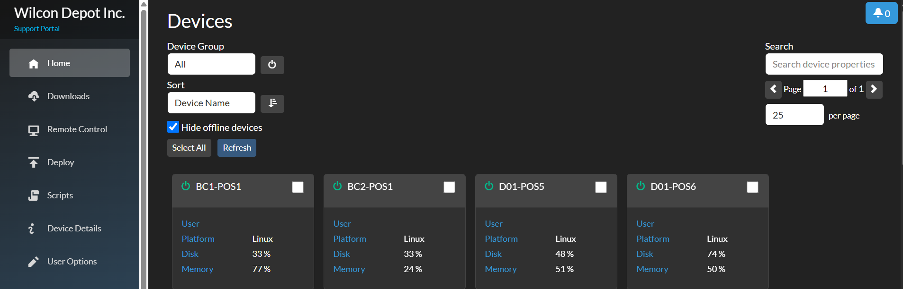
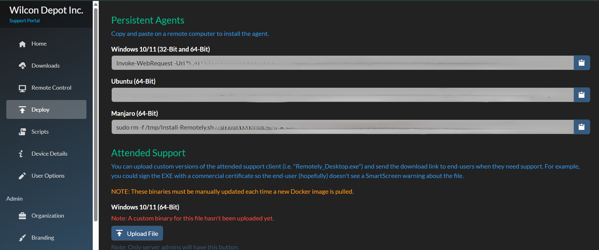
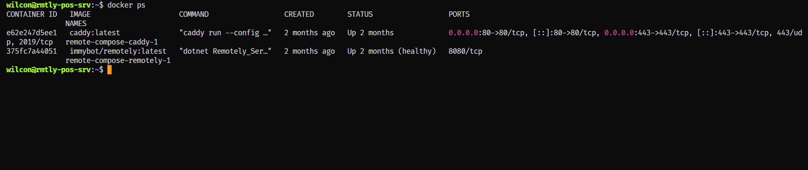
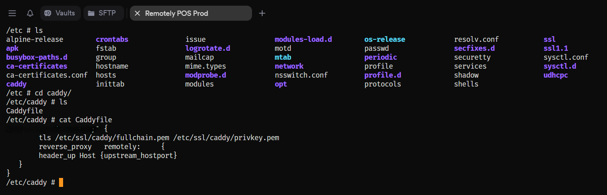

# Remotely Dashboard

- This is my Remotely dashboard showing real-time device metrics—user, platform, disk, and memory usage—for proactive monitoring and performance management

  

---

## Remotely Deploy Agent

- This section provides remote deployment commands for persistent agents across Windows, Ubuntu, and Manjaro, enabling secure and scalable remote support.

  

---

## Remotely Docker Containers

- This shows my Docker setup for Remotely and Caddy, running as containers with persistent health checks and exposed ports for secure remote access.

  

---

## Caddy as Reverse Proxy

- This is my Caddyfile configuration, where I set up TLS and reverse proxy rules to route traffic to the Remotely container securely.

  

---

