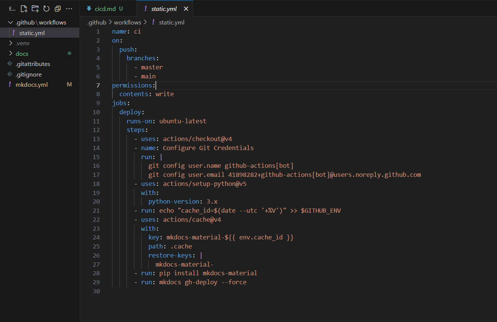
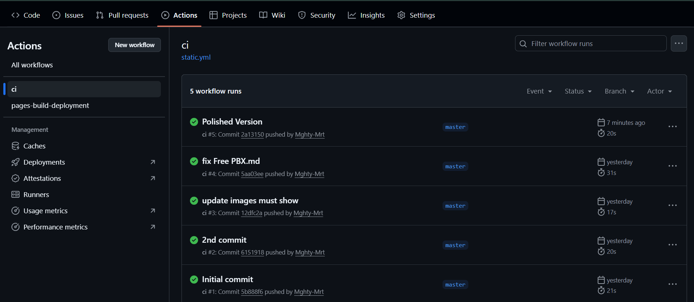
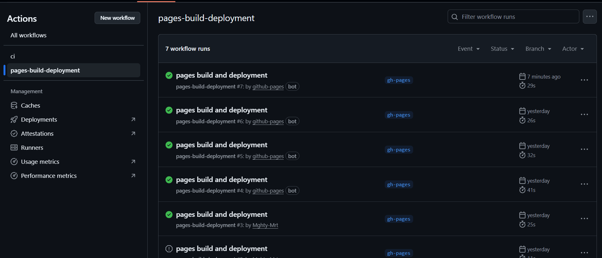

# Simple CI/CD Workflow

Github Actions Workflow for MkDocs Deployment:

- This workflow automates MkDocs Material deployment to GitHub Pages on every push to main or master, using Python setup, caching, and forced gh-deploy for seamless documentation updates.

  

---

CI Workflow

- This workflow runs automated checks on every commit to ensure documentation integrity and fast feedback.

  

---

Pages Build-Deployment

- This workflow builds and deploys the MkDocs site to GitHub Pages automatically after each push.

  